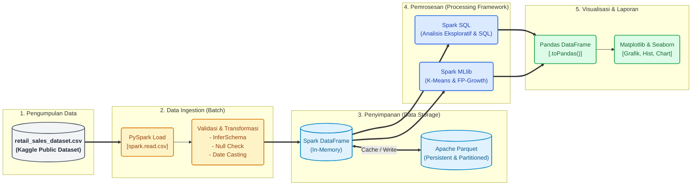

# Arsitektur Solusi Big Data (Bab 2)

Berikut adalah diagram arsitektur solusi Big Data yang dirancang menggunakan PySpark, mulai dari tahap pengumpulan data hingga visualisasi. Anda dapat mempratinjau diagram ini menggunakan Markdown previewer yang mendukung Mermaid (seperti GitHub atau plugin VSCode).

### Penjelasan Setiap Fase (Berdasarkan Bab 2):

1. **Pengumpulan Data:** Menggunakan sumber data statis dari berkas `retail_sales_dataset.csv` berisi transaksi ritel harian.
2. **Data Ingestion:** Pemrosesan secara _batch_ di mana data diserap oleh PySpark menggunakan `spark.read.csv`. Setelahnya, dilakukan pembersihan data seperti pengecekan nilai null dan pengubahan format teks ke _DateType_.
3. **Penyimpanan:** Data dalam memori disimpan sebagai **Spark DataFrame** untuk pemrosesan super cepat. Untuk penyimpanan permanen, data disimpan menggunakan struktur **Apache Parquet** yang dikompresi dan dipartisi.
4. **Pemrosesan:** Dibagi menjadi dua fungsi utama, yaitu **Spark SQL** untuk manipulasi data (agregasi pemasaran harian/bulanan) dan **Spark MLlib** untuk pembuatan model (segmentasi pelanggan dan asosiasi belanja).
5. **Visualisasi:** Setelah data diolah terdistribusi dengan Spark, hasil yang ukurannya sudah merepresentasikan agregat/kesimpulan *(insight)* dikonversi ke **Pandas** melalui `.toPandas()`, kemudian divisualisasikan dengan **Matplotlib/Seaborn** ke manajer dan pemangku kepentingan lainnya.
